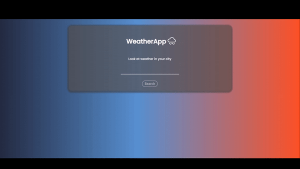
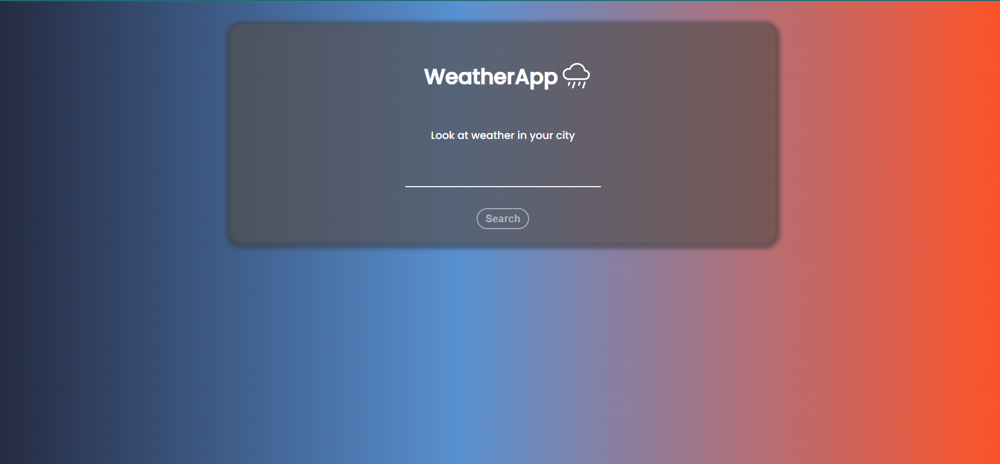

# WeatherApp - React

Simple weather app I created as a first Reactjs project

## Technologies
Project is created with:
* Reactjs - Used to build main stucture of the app
* Chartjs - Used to create charts do display weather info


 
## Screenshots

 


## API
In this project for weather data I used:
* https://openweathermap.org/

## Instalation

```bash
  npm install
  npm run
```
```bash
 const appid = "{Your_AppID}"
```

